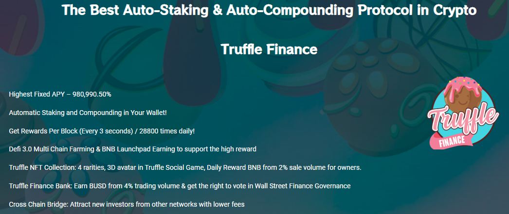

# 📌 Truffle Finance Overview

The Highest Sustainable <mark style="color:red;"></mark> Auto-stake/compound protocol in Defi

TRUFFLE rewards holders with a sustainable Fixed APY of **980.990,50%**  compounding **EVERY 3 SECONDS**. (This is theoretical limit in BSC)\
For example: An investment of $1000 TRUFFLE gives $**9,809,905.00** TRUFFLE in just 12 months.

But there' something more:

* TRUFFLE NFT Collection
* TRUFFLE Bank & Referral Program
* Defi 3.0 Multi Chain Farming & BNB Launchpad Earning
* Cross Chain Bridge

### 💸 Buy  💰 Hold  🤑 Earn

#### Truffle Finance provides a decentralized financial asset which rewards users with a sustainable fixed compound interest model through use of it's unique TRUFFLE system.

#### The Truffle Finance Auto-Staking Protocol (Truffle for short) is a new financial protocol that makes staking easier, more efficient and awards $TRUFFLE token holders the highest stable returns in crypto.

TRUFFLE gives the $TRUFFLE token automatic staking and compounding features, and the highest Fixed APY in the market at **980.990,50% **<mark style="color:green;">****</mark> for the first 12 months.

Truffle Finance is a company focused on DeFi innovation that creates benefits and value for $TRUFFLE token holders. Our Truffle protocol that is used within the $TRUFFLE token grants exceptional benefits for holders of $TRUFFLE:&#x20;

* **Low Risk with the Risk Insurance Fund (RIF)** - 6% buy and 6% sale are redirected to the RIF which helps sustain and back the staking rewards provided by the positive rebase.
* **Simple and Safe Staking -**  The $TRUFFLE token always stays in your wallet so it doesn’t need to be put into the hands of a 3rd party or centralized authority. All you need to do is buy & hold as you automatically receive rewards in your own wallet so there’s no more complicated staking processes at all.&#x20;
* **Interest Yield with Automatic Payments -** You need not be worry about having to re-stake your tokens. Interest yield is paid automatically and compounded in your own wallet, guaranteeing you will never miss a payment.&#x20;
* **Highest Fixed APY -** Truffle  Finance pays out at **980.990,50%** in the first 12 months which rivals anything in the DeFi arena to date. After the first 12 months the interest rate drops over a predefined Longterm Interest Cycle period.
* **Rapid Interest Payments -** The Truffle Finance Protocol pays every $TRUFFLE holder each and every 3 seconds or 28800 times each day, making it the fastest auto-compounding protocol in crypto.&#x20;
* **Auto Token Burn -** One of the exciting features of the Truffle  Finance Protocol is an automatic token burn system named “**Bonfire**” which prevents circulating supply getting out of hand and becoming unmanageable. **The Bonfire** burns 2% out of all $TRUFFLE Token market sales and is burned in the same individual transaction.

The Truffle uses a complex set of factors to support its price and the rebase rewards. It includes the **Risk Insurance Fund (RIF)** which serves as an insurance fund to achieve price stability and longterm sustainability of the Truffle  Protocol by maintaining a consistent **0.0000858% rebase rate** paid to all $TRUFFLE token holders per block (every 3 seconds).&#x20;

The Truffle  Finance development team has coordinated all of these elements together so they work seamlessly behind the scenes. The result is a simple and elegant staking and rewards system for $TRUFFLE holders. &#x20;

