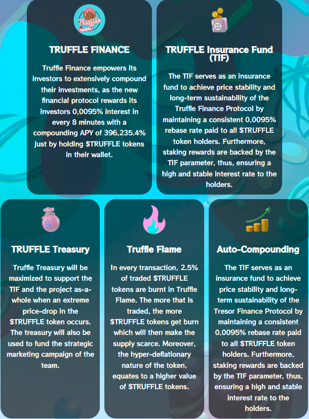

# 📌 Truffle Finance Overview

#### Truffle Finance provides a decentralized financial asset which rewards users with a sustainable fixed compound interest model through use of it's unique SAP protocol.

#### The Truffle Auto-Staking Protocol (SAP for short) is a new financial protocol that makes staking easier, more efficient and awards $TRUFFLE token holders the highest stable returns in crypto.

SAP gives the Truffle token automatic staking and compounding features, and the highest Fixed APY in the market at <mark style="color:green;">**396,235.4%**</mark> for the first 12 months.

Truffle is a company focused on DeFi innovation that creates benefits and value for Truffle token holders. Our SAP protocol that is used within the Truffle token grants exceptional benefits for holders of $TRUFFLE:

* <mark style="color:green;">**Low Risk with the Truffle Insurance Fund (TIF)**</mark> - 5% of all trading fees are stored in the Truffle Insurance Fund which helps sustain and back the staking rewards by maintaining price stability and greatly reducing downside risk.
* <mark style="color:green;">**Easy and Safe Staking**</mark>\*\* -\*\* The Truffle token always stays in your wallet so it doesn’t need to be put into the hands of a 3rd party or centralized authority. All you need to do is buy & hold as you automatically receive rewards in your own wallet so there’s no more complicated staking processes at all.
* <mark style="color:green;">**Interest Yield with Automatic Payments**</mark>\*\* -\*\* You need not be worry about having to re-stake your tokens. Interest yield is paid automatically and compounded in your own wallet, guaranteeing you will never miss a payment.
* <mark style="color:green;">**Highest Fixed APY**</mark>\*\* -\*\* Truffle pays out at 396,235.4% in the first 12 months which rivals anything in the DeFi arena to date. After the first 12 months the interest rate drops over a predefined Longterm Interest Cycle period.
* <mark style="color:green;">**Rapid Interest Payments**</mark>\*\* -\*\* The Truffle Finance pays every Truffle Token holder each and every 8 minutes or 104 times each day, making it the fastest auto-compounding protocol in crypto.
* <mark style="color:green;">**Auto Token Burn**</mark>\*\* -\*\* One of the exciting features of the Truffle Finance is an automatic token burn system named “TheTruffle Flame” which prevents circulating supply getting out of hand and becoming unmanageable. The Truffle Flame burns 2.5% out of all Truffle Token market sales and is burned in the same individual transaction.

The SAP uses a complex set of factors to support its price and the rebase rewards. It includes the **Truffle Insurance Fund (TIF)** which serves as an insurance fund to achieve price stability and longterm sustainability of the Truffle Finance by maintaining a consistent **0.0095% rebase rate** paid to all $TRUFFLE token holders **every 8 minutes**.

The Truffle development team has coordinated all of these elements together so they work seamlessly behind the scenes. The result is a simple and elegant staking and rewards system for $TRUFFLE holders.
