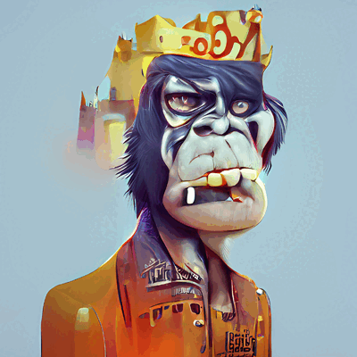

# 🌅 TRUFFLE NFT Collection

**Truffle Finance NFT** is a collection of 5,000 Truffle Avatars. Each NFT is unique and living on the Binance Smart Chain. With hundreds of artistic elements, each avatar is crafted by Truffle Team Artist.&#x20;

Truffle NFT collection uniquely interacts with the Truffle Ecosystem. There are 4 rarities: Common, Rare, Epic & Immortal. NFT Owners will receive BNB reward from 2% fee of $Truffle sale volume, use NFT as a citizen to play Truffle Social Game, AND trade the NFTs on the Truffle NFT Marketplace.

NFT Drop Rate:

* Common: drop rate 80%
* Rare: drop rate 15%
* Epic: drop rate 4%
* Immortal: drop rate 1%

**NFT Airdrop For Fair Launch Contributors:**

Top 10 Fair Launch Contributors: 1 Random NFT Immortal each person

Top 11-50 Fair Launch Contributors: 1 Random NFT Epic each person

Top 51-200 Fair Launch Contributors: 1 Random NFT Rare each person

Other contributors: 1 Random NFT Common each person (Min contribute 0.1 BNB for being eligible - Max 500 Common NFTs will be airdropped. If there are more eligible contributors than the total number of NFT airdropped, NFT Common will airdrop to random contributors who contributed more than 0.1 BNB)&#x20;

**NFT Airdrop For Discord Invitation Contest**

Top 1-3: 1 NFT Epic each person

Top 4-20: 1 NFT Rare each person

Top 21-100: 1 NFT Common each person

**NFT Airdrop For $Truffle** **Top Holders & Biggest Buyers Event After Launch:**

1000 NFTs will be airdropped for the Biggest Event After PancakeSwap listing - $Truffle Top Holders & Biggest Buyers Event

**NFT Minting Event**

3200 NFTs will be minted by $Truffle Token

