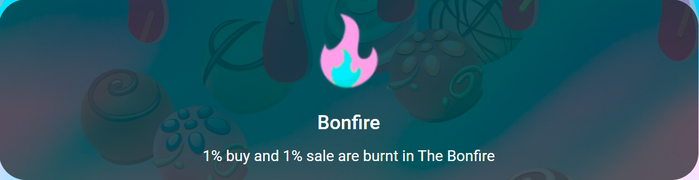

# 🔥 The Bonfire

1% from buy and 1% sell of all $Truffle traded are burnt in **The Bonfire** (send to a dead wallet). The more that is traded, the more get put into the fire causing the bonfire to grow in size, larger and larger through self fulfilling Auto-Compounding, reducing the circulating supply and keeping the Truffle Finance protocol stable.

The other benefit to an everlasting burn of circulating supply is that due to the deflationary nature of it, equates to a higher value of each $TRUFFLE token, therefore increasing the individual value.

