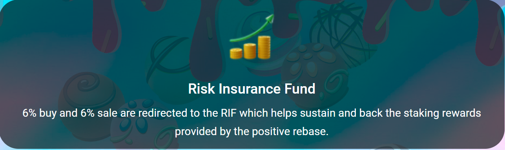

# 🛡 Risk Insurance Fund (RIF)

**RIF** is the acronym for the Risk Insurance Fund which is a separate wallet in **Truffle** system. The RIF uses an algorithm that backs the Rebase Rewards and is supported by a portion of the buy and sell trading fees that accrue in the RIF wallet. &#x20;

In simple terms, the staking rewards (rebase rewards) which are distributed every 3 seconds at a rate of **0.0000858%** are backed by the RIF parameter, thus ensuring a high and stable interest rate to $TRUFFLE token holders.&#x20;

6% of all trading fees are stored in the Risk Insurance Fund which helps sustain and back the staking rewards provided by the positive rebase.

Multi Chain Farming & BNB Launchpad Earning to support the high reward

### RIF Keeps holders safe by:

* Avoiding flash crash through price stability
* Achieving longterm sustainability and future growth of the Truffle Finance Protocol
* Greatly reducing downside risk

