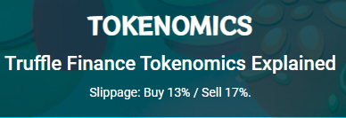

# 🪙 TRUFFLE Token

$TRUFFLE is a Bep20 token which rewards its holders with automatic passive interest payments per block (every 3 seconds) over the lifespan of 12 years until the maximum supply of 100 Billion tokens has been reached. &#x20;

**Is $TRUFFLE just another Titano Fork?**

We have used concept of titano, libero, safuu, etc\
But their system including smart contract has many flaws and unstable things such as EOA, high gas usage, big price drop at adding LP, etc. So we have referenced safuu's code to use the concept, and refined / reconstructed code to fix their flaws and to have more stable system.

You can check why we are better in [here](broken-reference)

We also have several proprietary mechanisms in place that we have created ourselves which offers many improvements over our competition such as:

* Risk Insurance Fund (RIF)
* The Truffle Treasury&#x20;
* NFT Collection
* Truffle Social Game
* The Bonfire
* Truffle Balance Auto-Liquidity Engine (BALE)
* Longterm Interest Mechanism (LIM)

as well as safeguards in place which secure against malicious hack attempts.&#x20;

$TRUFFLE tokenomics are also completely unique with our Auto-Burn Bonfire structure, small starting supply, highest APY **$980.990,50%**, and fastest 3 second EPOCH for a much more linear APY progression of attainability.

