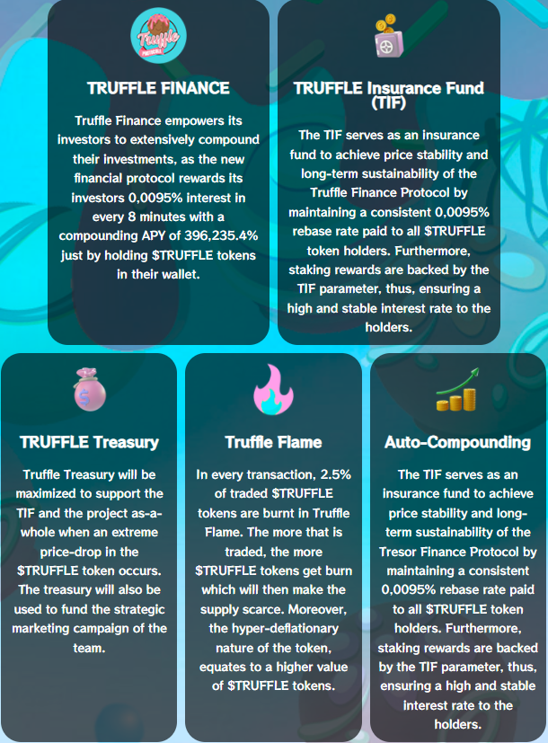

# 🏦 Truffle Treasury

The Truffle Treasury plays a very important role in Truffle's SAP protocol. It provides three extremely critical functions for the growth and sustainability of Truffle .&#x20;

The Truffle Treasury functions as additional financial support for the TIF. This additional support can become important in the event of an extreme price drop of the $TRUFFLE token or unforeseen black-swan event. It helps to establish a floor value for the $TRUFFLE token.&#x20;

The Truffle Treasury may also be used to fund new Truffle products, services, and projects that will expand and provide more value to the Truffle community aswell as providing funding for marketing. &#x20;

