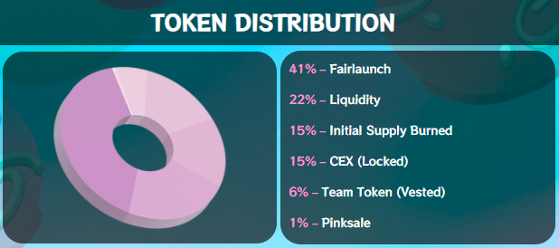

# 🚀 $Truffle Tokenomics

**Initial Supply - 325,000 $TRUFFLE**

&#x20;

**Available to Purchase on PinkSale**\
\
**Pre-Launch - 196,000 $TRUFFLE**

&#x20;****&#x20;

**Tokens for Liquidity -** 99,960 $TRUFFLE

&#x20;

**Token Breakdown -** 99,960 will be used for PancakeSwap to match 51% liquidity.\
\

**NO TEAM TOKENS -** The TRUFFLE Team will **NOT** hold any tokens. The only tokens owned by the TRUFFLE Treasury will be collected via accumulating trading fees. We are committed to the longevity of the project and thus the $TRUFFLE team cannot dump on you.

\
**NO EXTRA MINT OR HIDDEN TOKENS -** The $TRUFFLE smart contract has **NO** ability to mint extra tokens nor can the supply be manually increased or used in an artificial way to change the initial supply by awarding ourselves free tokens. The initial supply is 325,000 $TRUFFLE tokens only (please see the breakdown above).\
\

**NO RUG PULL -** Liquidity will be **locked for 401 days** via trusted Unicrypt.Network which cannot be touched or released early. (This means that you as a token holder will **ALWAYS** have the freedom to buy/sell whenever you like without restrictions or complications - your tokens that you buy are yours and remain in your wallet always and are never 'locked').\

